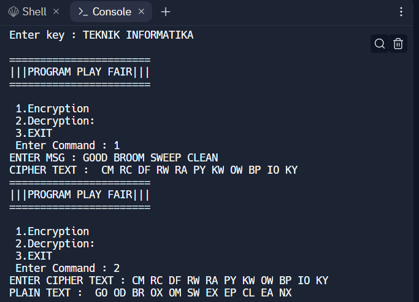
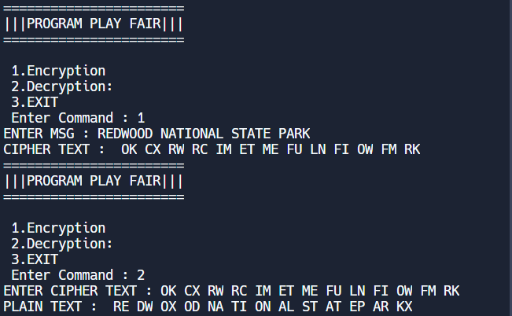
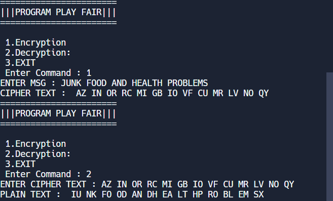

# Playfair Cipher

<table border="2" cellpading="10">
  <tr>
    <td><b>Nama</b></td>
    <td>Ilham Nur Utomo</td>
  </tr>
  <tr>
    <td><b>NIM</b></td>
    <td>312010129</td>
  </tr>
  <tr>
    <td><b>Kelas</b></td>
    <td>TI.20.A1</td>
  </tr>
  <tr>
    <td><b>MataKuliah</b></td>
    <td>Kriptografi</td>
  </tr>
  <tr>
    <td><b>Dosen Pengampu</b></td>
    <td>Ahmad Turmudizy,S.Kom.,M.Kom
</td>
</table>

Link Replit : [https://replit.com/@Ilham-NurNur4/tugaskriptografi#main.py](https://replit.com/@Ilham-NurNur4/tugaskriptografi#main.py)
 

- ;
   

- ;
   

- ;

